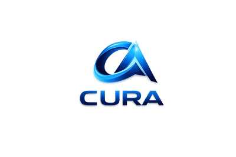

  

<h3 align="center">CURA Brand Guide</h3>

---

## Company overview

CURA is an AI automation consultancy that helps small and medium-sized enterprises eliminate administrative burden through intelligent automation. We combine strategic consulting with a proprietary Command Centre platform to deliver measurable ROI — saving teams hours every day and turning operational data into growth insights.

**Tagline:** AI Automation Consultancy For SMEs & Growing Businesses

**Category:** AI Automation Consultancy

**Website:** [cura-co.com](https://cura-co.com)

### Who we serve

We work with small and medium-sized enterprises, growing businesses that are scaling operations, and teams drowning in administrative work. Our clients are business owners and operators — not developers — who need results without complexity.

### Value proposition

Results-focused AI automation that delivers proven ROI — up to 6 hours saved per day — with a done-for-you implementation approach.

### What sets us apart

We're consultancy-led, not just software — we implement for you. Everything is results-focused with proven, measurable ROI. Our Command Centre platform gives full visibility across sales, ops, and finance. We show before-and-after transparency so clients see exactly what changes. And data protection and security are a core commitment, not an afterthought.

---

## Products

### AI Automation Services — "Done Right"

Strategic AI automation consulting with hands-on implementation for SMEs. This is our core offering: we identify where automation will have the biggest impact and then build it for you.

### Command Centre

CURA's proprietary platform giving businesses a unified dashboard across sales pipeline, revenue, team performance, operations, and financial insights. The platform is organized into these modules:

**Command Centre** (overview & KPIs) · **Acquire** (lead generation) · **Convert** (sales pipeline & funnel) · **Deliver** (fulfillment & ops) · **Support** (client support) · **Measure** (analytics & reporting) · **Team & Ops** (team management, sales team, technical team) · **Admin** (settings & configuration)

### AI Discovery Session — Free

A complimentary discovery session to identify automation opportunities within a business. This is our primary conversion entry point.

### Partners

Calendly · Dialpad · eClincher · Linktree

---

## Logo

The CURA logo is a 3D metallic blue "CA" monogram. The letters are intertwined in a sleek, swooping form — the "C" wraps around and flows into an upward-pointing "A" that suggests forward momentum and ascent. The mark has a polished, reflective finish with gradient blues ranging from deep navy to bright cyan, with a subtle light flare at the apex of the "A". The overall effect is dynamic, modern, and premium.

The **wordmark** sits below the icon: "CURA" set in uppercase, bold sans-serif with a blue gradient fill matching the icon. Letters are tightly tracked with a clean, solid presence.

### Logo colors

| Token | Hex | Usage |
|---|---|---|
| Primary Blue | `#1E5FAE` | Core body of the monogram |
| Highlight Cyan | `#4FC3F7` | Reflective highlights and edges |
| Deep Navy | `#0A2E6B` | Shadow and depth areas |
| Flare White | `#FFFFFF` | Apex light flare |

### Usage rules

The primary lockup is the icon stacked above the wordmark, centered vertically. The CA monogram can be used alone as a favicon and avatar. Always maintain minimum clear space equal to the height of the icon on all sides. The current logo is designed for dark backgrounds — a light variant should be produced for light contexts.

---

## Color system

### Foundation

These are the dark surfaces that make up the CURA UI. Everything builds on top of the near-black background.

| Token | Hex | Role |
|---|---|---|
| Background | `#080C14` | Primary page and app background — near-black with a cool blue undertone |
| Surface | `#0D1320` | Card and panel backgrounds — slightly elevated from the base |
| Surface Elevated | `#111827` | Elevated containers, modals, dropdowns |
| Border | `#1E293B` | Subtle borders and dividers between sections |
| Border Light | `#2A3A52` | Slightly more visible borders for interactive elements |

### Text

| Token | Hex | Role |
|---|---|---|
| Primary | `#F1F5F9` | Headings and primary body copy — high contrast on dark backgrounds |
| Secondary | `#94A3B8` | Supporting text, labels, meta information |
| Muted | `#64748B` | Placeholder text, disabled states, tertiary labels |

### Accent colors

| Token | Hex | Role |
|---|---|---|
| Primary Blue | `#3B82F6` | Primary interactive color — buttons, links, selected states, pipeline bars |
| Primary Blue (hover) | `#2563EB` | Hover and active state for primary blue |
| Teal | `#14B8A6` | Secondary accent — highlights, feature callouts, decorative emphasis ("Done Right", "Proven ROI") |
| Cyan | `#06B6D4` | Charts, data visualization, metric callouts |

### Semantic colors

| Token | Hex | Role |
|---|---|---|
| Success | `#22C55E` | Positive status — completed calls, revenue growth, active indicators |
| Warning | `#F59E0B` | Caution states, pending items, needs-attention flags |
| Error | `#EF4444` | Errors, overdue items, alert states, flags |
| Info | `#3B82F6` | Informational badges, scheduled status indicators |

### Chart colors

| Token | Hex | Role |
|---|---|---|
| Line Green | `#22C55E` | Revenue and MRR growth lines |
| Line Cyan | `#06B6D4` | Secondary data series |
| Area Fill | `#22C55E10` | Transparent fill beneath chart lines |
| Pipeline Blue | `#3B82F6` | Pipeline funnel bars and progress indicators |

### Gradients

**Hero Glow** — `radial-gradient(ellipse at center top, rgba(59,130,246,0.15) 0%, transparent 60%)` — Subtle blue glow behind hero sections on the marketing site.

**Card Shine** — `linear-gradient(135deg, rgba(255,255,255,0.03) 0%, transparent 50%)` — Very subtle highlight on elevated cards.

**CTA Button** — `linear-gradient(135deg, #3B82F6, #2563EB)` — Primary call-to-action button fill.

---

## Typography

**Philosophy:** Clean, modern, and highly legible. Type does the heavy lifting on dark backgrounds, so weight contrast and spacing are critical.

**Primary font:** Inter, system-ui, -apple-system, sans-serif

**Monospace:** JetBrains Mono, ui-monospace, monospace

### Type scale

| Role | Size | Weight | Line height | Notes |
|---|---|---|---|---|
| Hero heading | 2.5–3.5rem | 700 | 1.15 | Letter-spacing: -0.02em |
| Section heading | 1.75–2.25rem | 600 | 1.25 | Letter-spacing: -0.01em |
| Card heading | 1.125–1.25rem | 600 | 1.35 | — |
| Body | 0.9375–1rem | 400 | 1.6 | — |
| Label | 0.75–0.8125rem | 500 | 1.4 | Uppercase, letter-spacing: 0.02em |
| Metric | 1.5–2rem | 700 | 1.2 | Large dashboard numbers |
| Metric label | 0.75rem | 400 | 1.4 | Secondary color, sits beneath metrics |

---

## Spacing, radii, and shadows

### Spacing

The base unit is 0.25rem (4px). Section padding runs 4–6rem vertically. Cards use 1.25–1.5rem internal padding with 1–1.5rem gaps between them. Component-internal gaps are 0.75rem.

### Border radius

| Token | Value |
|---|---|
| Small | 0.375rem |
| Medium | 0.5rem |
| Large / Card | 0.75rem |
| Pill | 9999px |

### Shadows

**Card** — `0 1px 3px rgba(0,0,0,0.3), 0 0 0 1px rgba(255,255,255,0.03)` — Subtle depth with a faint inner border.

**Elevated** — `0 4px 12px rgba(0,0,0,0.4)` — Modals and elevated panels.

**Glow** — `0 0 30px rgba(59,130,246,0.15)` — Soft blue ambient glow for featured elements.

---

## UI patterns

### Navigation

The Command Centre platform uses a collapsible left sidebar. The marketing site uses a top navbar. Sidebar sections follow the product module order: Command Centre, Acquire, Convert, Deliver, Support, Measure, Team & Ops, Admin. The selected state uses a highlighted background with accent blue text and a left border indicator.

### Dashboard cards

Dark surface cards with subtle borders, each displaying a single KPI metric prominently with a smaller label beneath. Often include a colored icon or mini chart. Laid out in a responsive grid — typically 4 across on desktop, stacking down on smaller screens.

### Status badges

Small colored badges for status: green for completed, blue for scheduled, red/orange for overdue. All use pill-shaped border-radius.

### Tables

Dark-themed with alternating subtle row backgrounds, clean column headers in uppercase labels, and inline action badges. Header text is muted, uppercase, small font with letter-spacing.

### Buttons

**Primary** — Blue gradient background, white text, rounded corners, subtle shadow.

**Secondary** — Transparent with border, light text, rounded corners.

**CTA** — Wider padding, sometimes with an arrow icon, used for key conversion actions.

### Charts

Line and area charts with green/cyan data lines on dark backgrounds, minimal grid lines, and a soft glow area fill. Pipeline funnels use horizontal bars in blue, stacked vertically to represent stages.

### Search bar

Centered in the top nav with a subtle border, placeholder text, and keyboard shortcut hint.

---

## Voice and tone

### Personality

We are confident but not arrogant — we let results speak. Direct and clear — no jargon for jargon's sake. Warm and approachable — we work with SMEs, not enterprises with infinite budgets. Action-oriented — always pointing toward a next step.

### Tone by context

**Marketing** — Bold, benefit-led, and empathetic to the pain of admin overload. We name the problem clearly ("Administrative Work is Drowning Your Team") before presenting the solution. Highlights are data-driven — hours saved, ROI percentages.

**Product** — Clean and functional. Labels are short. Metrics are prominent. The UI does the talking — minimal explanatory copy.

**Support** — Helpful, patient, human. We guide rather than lecture.

### Writing principles

Lead with the outcome, not the feature. Use concrete numbers over vague promises. Keep it scannable — short paragraphs, clear headings. Speak to the business owner, not the developer. Emphasize ease — "done for you", not "DIY".

### Key phrases

These are the phrases that define how CURA speaks:

"AI Automation, Done Right" · "Results-Focused Implementation" · "Real Results, Proven ROI" · "Your Data, Protected" · "Up to 6 hours saved per day"

### What we avoid

Overly technical AI/ML terminology without context. Hype language ("revolutionary", "game-changing") without backing data. Passive voice when describing what CURA does. Jargon that alienates non-technical SME owners.

---

## Data and security

### Key stats

We save teams up to 6 hours per day, with proven ROI across our client base.

### Command Centre KPIs

The platform surfaces these metrics: Total Commission, Estimated Fees, Revenue (Achieved), Technical Revenue, Total Pipeline, Revenue Collected, MRR Growth, Pipeline Funnel, and Lead Velocity.

### Team metrics

Per-rep visibility includes: Weekly Activity, 30-Day Conversion Rate, Pipeline Value, Revenue MTD, and Commission MTD.

### Security commitment

"Your Data, Protected" — Data security is a core brand pillar, prominently featured on the marketing site with its own dedicated section. This reinforces trust for SME clients who may be cautious about AI and data handling.
